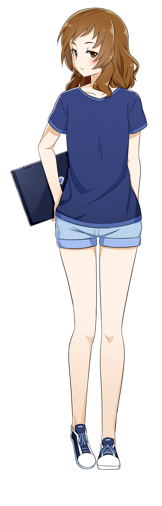
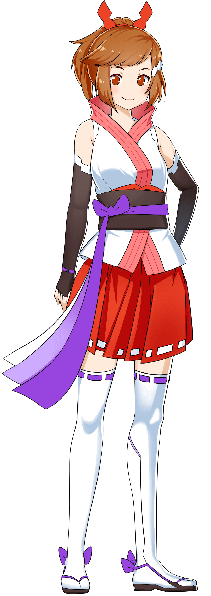
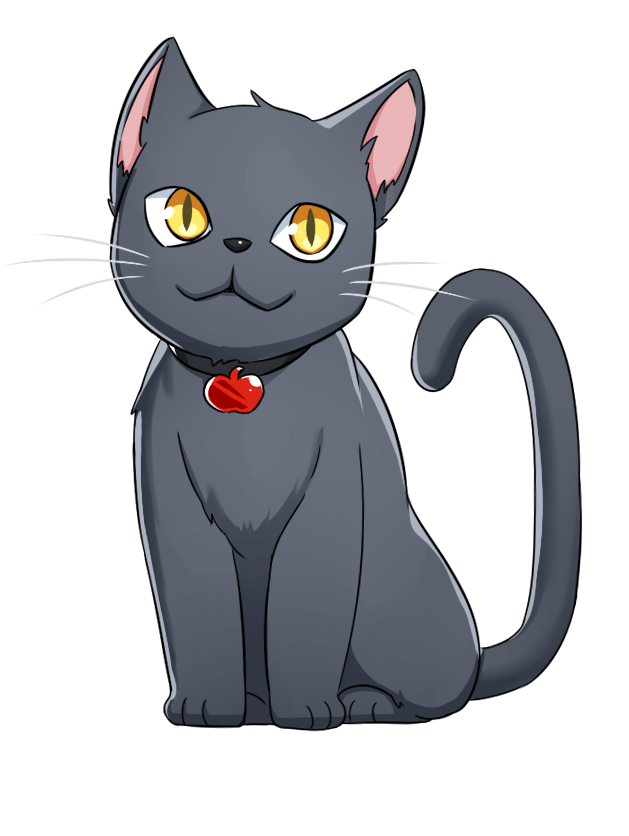
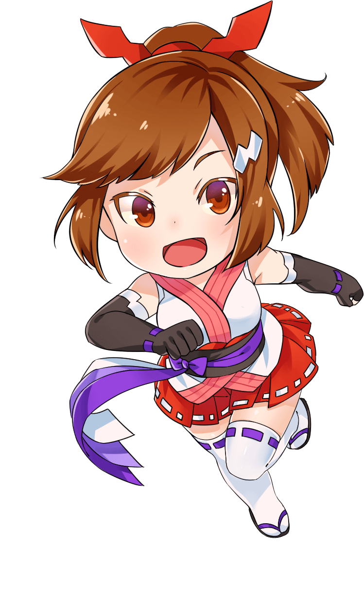

##### First Name
Allison

##### Online Handle
Mina Issho-ni ("Minna issho ni", "Everyone Together")

##### Gender
Female

##### Classification
Human

##### Location
Nomad

##### Blood Type
O

##### Myers-Briggs
INTP (ENFP in the virtual world)

##### Standard Equipment
Laptop

##### Pet(s)
Cat named Bob (In the virtual world, she has a panther mount which looks kind of like Bob)

##### Favorite Food
Apples, Ramen

##### Hobbies
Programming, MMOs, Camping, Watching Anime, Reading

##### Lore Summary
The Virtual World Oracles' keys have been compromised and all events in the virtual world is being called into question. The Oracles have been the good and honorable protectors in charge of ensuring the security of the virtual world, but now the virtual reality is breaking down by unknown forces -- conversations go to the wrong people and chaos ensues. Everyone is unsure on what is real in the virtual world and it is affecting the physical world.

Mina, Allison in the physical world, spends most of her time in the virtual world when she isn't out camping. She is especially appreciated for programming rooms and environments in the virtual world. Her experience understanding the intricacies of the virtual world makes her and her friends the ones to save the virtual world.

The Oracles had been diligently maintaining the virtual world and had always been the watchful protectors, knowing that if any one of them fall, they all fall. Mina and her friends deduce that three people/entities in the virtual world (Sakujo, Kyohi, Bunkatsu) are responsible for compromising the Oracles' keys via theft and battle. The keys are usually in the center of the virtual world but cannot be opened. Mina and her friends battle the villains in the virtual world and eventually overcome them, but cannot resolve the current compromised central system maintaining the keys.

Mina and her friends devise a way to rebuild the virtual reality, but it requires everyone in the virtual world to maintain the system, not just the Oracles and their keys. In the last battle, her avatar is locked in the central system and can only be recovered by worldwide cooperation and agreement where everyone together in the virtual world has ownership, control, and contribution with maintaining the system. As it is up to everyone and not just her (not to mention her avatar is locked in statis), she does not ever communicate on future changes to the virtual world and leaves the future in the hands of her friends and everyone in the virtual world.

##### Images

